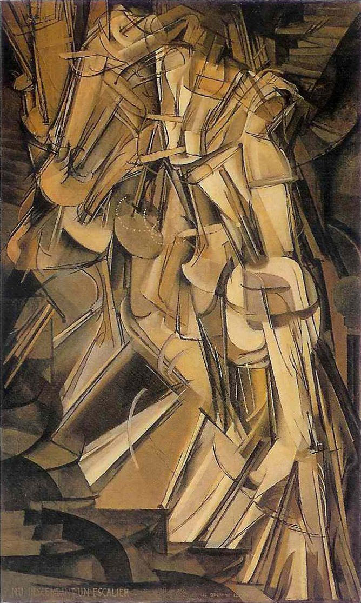

slidenumbers: true

## *Snakes & Ladders*:
## a taste of **Scala** for **python**istas

----


## **Scala***(EPFL, Lausanne):* 
### functional, OO, advanced type system

----


## **Python***(CWI Amsterdam):* 
### multi-paradigm

----

## Can we go from one to the other? 
## *Why* should *we*?

---- 


### **Scala** is the language showing fastest growth in the data science and engineering field[^1]

[^1]: [The Most Popular Language For Machine Learning and Data Science Is …](http://www.kdnuggets.com/2017/01/most-popular-language-machine-learning-data-science.html)

----

# Some reasons why **Scala** is trendy

1. Runs in the *JVM* (interoperates with **Java** 🤢)
2. *Apache Spark* is in **Scala** (can be used from **Python** 😍)
3. **Scala** developers earn more 🤑

----

# But...

1. It runs on the *JVM*... Yikes! 🤢
2. **Scala** looks weird 🤡
3. There is a lot of jargon in **Scala**  🤑

----

### So...

### Today we'll see how **Scala** is _not that weird_ if you know *(weird)* **Python**

----


# whoami

- Ruben Berenguel
- PhD in Mathematics
- (big) data consultant
- Writing some **Python** for the past 12 years
- Started with **Scala** a year ago
- Right now at **Affectv** in London (we are hiring!)

----


## **Scala** is statically typed: no `int` + `str` in **production**

----

## We have **MyPy**: **Python**'s static type checker!

----

```python, [.highlight: 4, 6, 8]
# mypy_example.py:
from typing import List

answer = 42  # type: int

dont = "panic"  # type: str

again = ["don't", "panic"]  # type: List[str]
```

Typecheck the file with: `mypy mypy_example.py`: 👍

----

```python, [.highlight: 1, 4, 5, 6]
# mypy_bad.py
from typing import List

answer = 42  # type: str
dont = "panic"  # type: int
again = ["don't", "panic"]  # type: List[float]
```

Typecheck the file with: `mypy mypy_example.py`: 👎

```
mypy_bad.py:3: error: Incompatible types in assignment 
    (expression has type "int", variable has type "str")
mypy_bad.py:5: error: Incompatible types in assignment 
    (expression has type "str", variable has type "int")
mypy_bad.py:7: error: List item 0 has incompatible type "str"
mypy_bad.py:7: error: List item 1 has incompatible type "str"
```

----


# **Scala** lets you do fancy type-level stuff, but the *basics* are the same as in **mypy**

----

```scala, [.highlight: 1, 4, 7]
scala> val answer: Int = 42
answer: Int = 42

scala> val dont: String = "panic"
dont: String = panic

scala> val again: List[String] = List("don't", "panic")
again: List[String] = List(don't, panic)
```

```scala, [.highlight: 1, 3,4]
scala> val noAnswer: Int = "panic"
<console>:11: error: type mismatch;
 found   : String("panic")
 required: Int
       val noAnswers: Int = "panic"
```

----

# Can also infer types

```scala, [.highlight: 1, 4, 7]
scala> val answer = 42
answer: Int = 42

scala> val dont = "panic"
dont: String = panic

scala> val again = List("don't", "panic")
again: List[String] = List(don't, panic)

```

----

## Type inference is done by **the typer**

#### `typer`   **4**  the meat and potatoes: type the trees

----

# The **Scala** compiler has 24 phases 
### (Slooow)


----


# Case classes are _cool_

----

```scala
scala> case class Person(name: String, age: Int) {
     | def greet = s"Hello, $name"
     | }
defined class Person

scala> val someone = Person("Joe Doe", 42)
someone: Person = Person(Joe Doe,42)
```

Q: *is greet a function?*

A: *In* **Scala***,* **everything** *is* (kind of) *a function*[^2]

[^2]: Everything is an expression (hence has a value), and that value is actually an object 🙀

----

## Because of **pattern matching**

----

```scala
// someone: Person = Person(Joe Doe,42)
scala> someone match {
     | case Person("Joe Doe", _) => someone.greet
     | case _ => "Who are you?"
     | }
//res0: String = Hello, Joe Doe

// someoneElse: Person = Person(Jane Doe,43)
scala> someoneElse match {
     | case Person("Joe Doe", _) => someoneElse.greet
     | case _ => "Who are you?"
     | }
//res1: String = Who are you?
```
---

## Sadly we don't have anything similar in **Python**

#### (but we laugh last: when **Scala** devs need to mock objects 😬)

----


## In Python we can use **abstract base classes** to define _how_ classes need to behave

### (enforced at instantiation time)

----

```python
from abc import ABCMeta, abstractmethod

class Singer(metaclass=ABCMeta):
    @abstractmethod
    def sing(self, tune):
        pass

class GuitarPlayer(metaclass=ABCMeta):
    @abstractmethod
    def rock(self, tune):
        pass

class Rocker(Singer, GuitarPlayer):
    def sing(self, tune):
        return f"YEAH {tune}"

    def rock(self, tune):
        return f"🎸 {tune} 🎸"

class BadRocker(Singer):
    pass
```

----
```python
>>> from abstract_example import Rocker
>>> gene_simmons = Rocker()

>>> gene_simmons.sing("Psycho Circus")
YEAH Psycho Circus

>>> gene_simmons.rock("Strutter")
🎸 Strutter 🎸
```

----

```python
>>> from abstract import BadRocker
>>> foo = BadRocker()
```
```
Traceback (most recent call last):
  File "<stdin>", line 1, in <module>
TypeError: Can't instantiate abstract class BadRocker 
    with abstract methods sing
```

----
## With **ABC**s & **mypy** we can ensure type safety

----

```python
def max_rock(rocker: Rocker, tune: str) -> str:
    return f"{rocker.rock(rocker.sing(tune))}"

gene_simmons = Rocker()
max_rock(gene_simmons, "I was made for loving you")
```
This is all cool for **mypy**

----


```python
justin_bieber = Singer()
max_rock(justin_bieber, "Some crap")
```


**Mypy** says: 

```
abstract_example.py:34: error: 
    Argument 1 to "max_rock" 
      has incompatible type "Singer"; 
      expected "Rocker"`
```

----



## Although **Scala** has `abstract` (like Java), the preferred way is using **traits**

#### scala, abstract -> staircase, Duchamp

----

```scala
trait CanSing {
  def sing(tune: String): String = {
    tune
  }
}

case class Singer(name: String, band: String) extends CanSing

trait PlaysGuitar {
  def rock(tune: String): String
}

case class Rocker(name: String, band: String) extends CanSing with PlaysGuitar {
  override def sing(tune: String): String = {
    s"YEAH ${tune}"
  }

  def rock(tune: String): String = {
    s"🎸 ${tune} 🎸"
  }
}
```

----

```scala, [.highlight: 2-14,]
object TraitsExamples {
  def maxRock(rocker: Rocker, tune: String): String =
    s"${rocker.rock(rocker.sing(tune))}"

  def guitarIt(player: PlaysGuitar, tune: String): String =
    s"${player.rock(tune)}"

  def main(args: Array[String]): Unit = {
    val geneSimmons = Rocker("Gene Simmons", "KISS")
    
    println(maxRock(geneSimmons, "I was made for loving you"))
    println(guitarIt(geneSimmons, "Strutter"))

    // val justinBieber = Singer("Justin Bieber", "himself")
    // maxRock(justinBieber, "some crap")
    //   traits.scala:24: error: type mismatch;
    //   found   : Singer
    //   required: Rocker
  }
}
```

----

# 👻 
## Implicits in **Scala**
# 👻

----


## They don't make much sense in **Python**[^3] but in **Scala** they let you do a bit of **magic**

[^3]: We have monkey-patching, but it breaks **mypy** type checking though

----

```scala
object Something {
  private def doWhatever(config: Config) = {
    implicit val spark = SparkSession.builder
      .appName(Config.appName)
      .getOrCreate()
      
    Another().doCoolSparkyStuff(42)  
  }
}

class Another {
  def doCoolSparkyStuff(num: Int)(implicit spark: SparkSession): Int = {
    ...
  }
}
```

----

### At first look they look like global variables, but strict **type checking** and **scoping** make implicits *terribly* useful

----

This slide intentionally left blank because *type classes* are too weird

----


### After working a bit with **Scala** I have discovered many, many things we can do in **Python** easier and better

### Learn some **Scala** and come back to **Python**!

----

You can find code samples and the presentation source in

[github.com/rberenguel/snakes\_and\_ladders](http://github.com/rberenguel/snakes_and_ladders)

You can get the presentation from

[Slideshare.com/rberenguel/](https://www.slideshare.net/rberenguel/)

----

#### **References and sources**

#### [Scala growth graph](http://www.kdnuggets.com/2017/01/most-popular-language-machine-learning-data-science.html)
#### [EPFL staircase by Miles Sabin](https://www.flickr.com/photos/montpelier/3957416434/)
#### [Snake picture](https://unsplash.com/search/snake?photo=HaGwCk2AD84)
#### [Snakes and ladders board](https://www.flickr.com/photos/mythoto/15415962934/in/photolist-pufQGo-fJ9zc9-5U6Rer-bDV4pD-aX9wDK-5U6Rei-a5RDDj-9j7Ywc-asQ5cn-8RkUAE-bmWMxg-dWaUez-n4N3Sv-6S9RNh-6TMyGq-kXsk1W-qWRzzd-RwxBG-re4XC-RwQ29-4D3W38-5MW3P-Hbv4HD-d7dqS-cBxGQG-ej3uFR-c6Gmkm-DXHhDj-RyUrR-gN9ga-7wy8Be-rZ9Eq-kxRSuz-n2oWuZ-fxo2si-7t3hSk-dJd8Ar-72iCk-pdRJnc-rZ9DN-53h9LS-9JN1KG-at8rvB-p5fAAa-47sWrF-UioVef-8kptuk-pGgU5A-HqnDP-89u1UB)
#### Twelfth Doctor gif: from _Doctor Who_
#### [Pillars](https://unsplash.com/search/pillar?photo=MM5rpMpC9k4)
#### [Witch](https://unsplash.com/search/witch?photo=LimTlHVpvRg)
#### [Nude Descending a Staircase, No. 2 by Marcel Duchamp, Wikipedia](https://en.wikipedia.org/wiki/Nude_Descending_a_Staircase,_No._2#/media/File:Duchamp_-_Nude_Descending_a_Staircase.jpg)
#### *Fixes in production gif*: from Buster Keaton's _The General_
